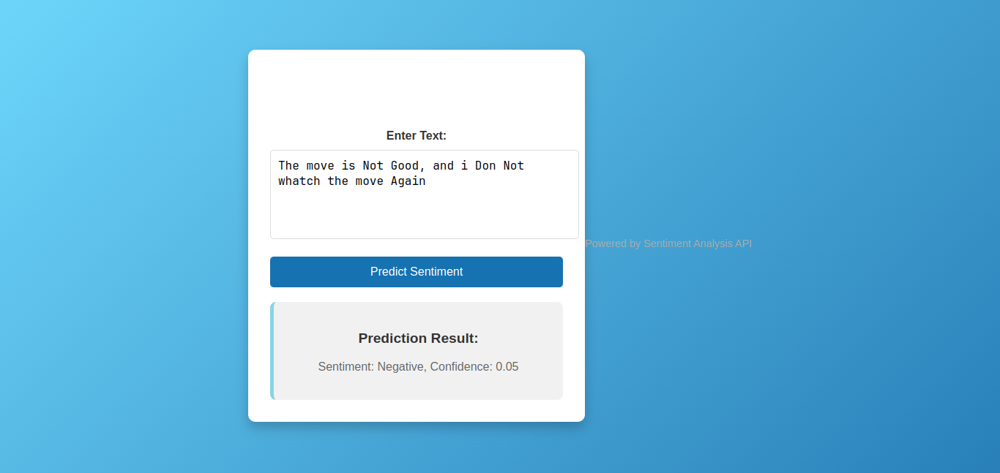

# Sentiment Analysis API

This project provides a FastAPI-based web application for **sentiment analysis** using a pre-trained deep learning model. The API takes text input, processes it through a pipeline that includes text cleaning and tokenization, and predicts the sentiment (positive or negative). The results are displayed on a web page with confidence scores for each prediction.

## Project Structure

```
.
├── src/
│   ├── api/
│   │   ├── main.py                   # FastAPI app for API and HTML page
│   │   └── template/
│   │       └── index.html            # HTML page for user input and displaying results
│   ├── model/
│   │   └── load_pre_trained_model.py # Load the trained model
│   ├── processing/
│   │   └── clean_text.py             # Text cleaning utilities
│   └── utils/
│       ├── logging_utils.py          # Logging utilities
│       └── load_tokenizer.py         # Load tokenizer from a pickle file
├── models/
│   ├── final_sentiment_model.h5      # Pre-trained sentiment analysis model
│   └── tokenizer.pickle              # Pre-trained tokenizer
└── README.md                         # Project documentation
```

## Getting Started

### Prerequisites

- **Python 3.8+**
- **FastAPI** and **Uvicorn**
- **TensorFlow** and **Keras**
- **Jinja2** for template rendering

Install dependencies:

```bash
pip install fastapi uvicorn tensorflow jinja2
```

### Running the Application

1. **Clone the repository** and navigate to the project directory.

2. **Start the FastAPI application** using Uvicorn:

   ```bash
   uvicorn src.api.main:APP --reload
   ```
3. **Access the application** by navigating to `http://127.0.0.1:8000/` in your web browser. You will see an HTML form where you can enter text for sentiment analysis.


- **`docker pull alrashidissa/sentiment_analysis_app:latest`**: This command downloads the latest version of the Docker image from Docker Hub.
- **`docker run -p 8000:8000 alrashidissa/sentiment_analysis_app`**: This command runs the Docker container, forwarding port `8000` on your local machine to port `8000` inside the container. This makes the FastAPI application accessible at `http://localhost:8000`.

---

This updated README provides clear instructions for users to run your Docker image, and includes basic details about the API usage.

## Usage

1. **Enter the text** in the text area on the homepage and click **Submit**.
2. The application will clean the text, tokenize it, and make a sentiment prediction.
3. **Prediction results** (Positive or Negative) will be displayed with the confidence score.

## Model Performance

The sentiment analysis model was evaluated on a test set of **10,000 samples** with the following metrics:

| Metric            | Negative | Positive | Macro Avg | Weighted Avg |
|-------------------|----------|----------|-----------|--------------|
| **Precision**     | 0.89     | 0.84     | 0.87      | 0.87         |
| **Recall**        | 0.83     | 0.90     | 0.86      | 0.86         |
| **F1-Score**      | 0.86     | 0.87     | 0.86      | 0.86         |
| **Accuracy**      | -        | -        | 0.86      | 0.86         |
| **Support**       | 4961     | 5039     | 10000     | 10000        |

### Classification Report Summary

The model achieves **86% accuracy** overall with the following class-specific results:
- **Negative Sentiment**: Precision of 89%, Recall of 83%, F1-score of 86%
- **Positive Sentiment**: Precision of 84%, Recall of 90%, F1-score of 87%

## Project Details

### Sentiment Prediction Pipeline

The pipeline for sentiment prediction includes:
1. **Text Cleaning**: Removing special characters and stopwords.
2. **Tokenization and Padding**: Text sequences are tokenized and padded to match the model’s input requirements.
3. **Prediction**: Processed text is fed into the pre-trained model, which outputs a probability score indicating sentiment.

### Custom Logging

The application uses custom logging for tracking key events and potential errors in the prediction pipeline. Logging is configured in `utils/logging_utils.py`.

## Additional Information

### Development

This project is designed to be modular, with each component independently developed and tested to ensure flexibility and maintainability.

### Future Work

Planned improvements include:
- Adding more sentiment classes (e.g., neutral).
- Enhancing the cleaning pipeline for diverse text formats.
- Fine-tuning the model with additional data for improved accuracy.

## License

This project is licensed under the MIT License. See `LICENSE` for more details.

## Acknowledgements

Special thanks to the contributors and the open-source community for their resources and support in building this application.



---